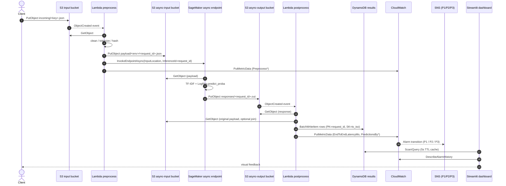

# Architecture · sentiment-aws

A fully serverless real-time sentiment classification pipeline on AWS.

## High-level diagram

```text
[Client] → [S3 input bucket] --(ObjectCreated)--> [Lambda preprocess]
                                                       |
                                                       v
                                         [SageMaker async endpoint: TF-IDF + LogReg]
                                                       |
                                                       v
                             [Lambda postprocess] → [DynamoDB results table]
                                         |                          |
                                         v                          v
                                 [CloudWatch metrics]      [Streamlit dashboard]
                                         |
                                         v
                             [SNS severity-tiered topics]  (P1 / P2 / P3)
```

## Sequence — single request



## Latency budget

End-to-end (from `S3 PutObject` on the input bucket to a row visible in
DynamoDB):

| Quantile | Target  | Smoke-test enforced |
|---------:|:-------:|:--------------------:|
| p50      | ≤ 350ms | indicative           |
| p95      | ≤ 800ms | **yes** (deploy gate)|
| p99      | ≤ 1500ms| **yes** (deploy gate)|

`scripts/latency_smoke_test.py` submits 100 payloads after each deploy and
exits non-zero if either p95 or p99 is breached, which fails the
CloudFormation deploy in CI.

## DynamoDB schema

| Attribute      | Type | Notes                                         |
|----------------|------|-----------------------------------------------|
| `request_id`   | S    | PK — UUID generated by preprocess Lambda.     |
| `timestamp_iso`| S    | SK — ISO-8601 UTC, microsecond resolution.    |
| `text_hash`    | S    | SHA-256 first-16 of cleaned text.             |
| `sentiment`    | S    | `positive` / `negative`.                      |
| `confidence`   | N    | float in [0,1].                               |
| `scores`       | M    | per-class probabilities.                      |
| `model_version`| S    | GSI HK — version-sliced reads.                |
| `latency_ms`   | N    | end-to-end (S3 PutObject → row visible).      |
| `inference_ms` | N    | model-only inference time.                    |
| `env`          | S    | `dev` / `staging` / `prod`.                   |
| `source_uri`   | S    | back-pointer to the input object.             |
| `ttl`          | N    | 90-day TTL (configurable).                    |

GSI: `model_version-timestamp_iso-index` (PROJECTION ALL).

## Alarms · severity tiers

| Severity | Trigger                                                           | Topic          |
|----------|-------------------------------------------------------------------|----------------|
| **P1**   | endpoint 5xx > 5% for 2 min, **OR** DDB throttles > 10/min        | `*-p1-critical`|
| **P2**   | p99 e2e latency > 1500ms for 5 min, **OR** rolling acc < 0.78     | `*-p2-warning` |
| **P3**   | rolling-window accuracy delta > 3pp (concept drift)               | `*-p3-info`    |

Each alarm carries:
- `AlarmDescription` includes the runbook URL (`RunbookBaseUrl/<slug>`).
- Tags: `Severity=Pn`, `Service=sentiment`, `Env=<env>`.

## Configuration store

- **SSM Parameter Store** (non-secret): `/sentiment/<env>/{endpoint_name,
  results_table, model_version, input_bucket, accuracy_gate}`.
- **AWS Secrets Manager** (credentials, e.g. third-party labelling
  webhook tokens): `sentiment/<env>/<name>`.

## Deployment

```bash
scripts/deploy.sh dev
scripts/deploy.sh staging
scripts/promote.sh   # staging → prod gated on accuracy ≥ 0.78
```

CI ordering: `lint → unit tests → cfn-lint → deploy dev → integration smoke
→ deploy staging → manual approval → promote.sh prod`.

## Teardown

```bash
scripts/teardown.sh dev
scripts/teardown.sh staging
scripts/teardown.sh prod --force
```
